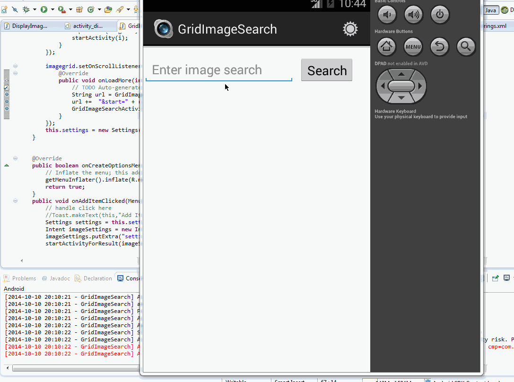

AndroidGoogleImageSearch
========================

Android App for the google Image Search

Time spent: 8 hours spent in total

Completed user stories:
 Required: 
 		   User can Search for an Image.
 		   User can click on "settings" which allows selection of advanced search options to filter results
		   User can configure advanced search filters such as:
				Size (small, medium, large, extra-large)
				Color filter (black, blue, brown, gray, green, etc...)
				Type (faces, photo, clip art, line art)
				Site (espn.com)
		  Subsequent searches will have any filters applied to the search results
		  User can tap on any image in results to see the image full-screen
		  User can scroll down “infinitely” to continue loading more image results (up to 8 pages)
 
 
Notes:
Spent some time making the UI work across multiple phone resolutions by playing around with the RelativeLayout.
Spent Some considerable time on networking  and Endless Scrolling feature.

Walkthrough of all user stories:

GIF created with [LiceCap](http://www.cockos.com/licecap/).
